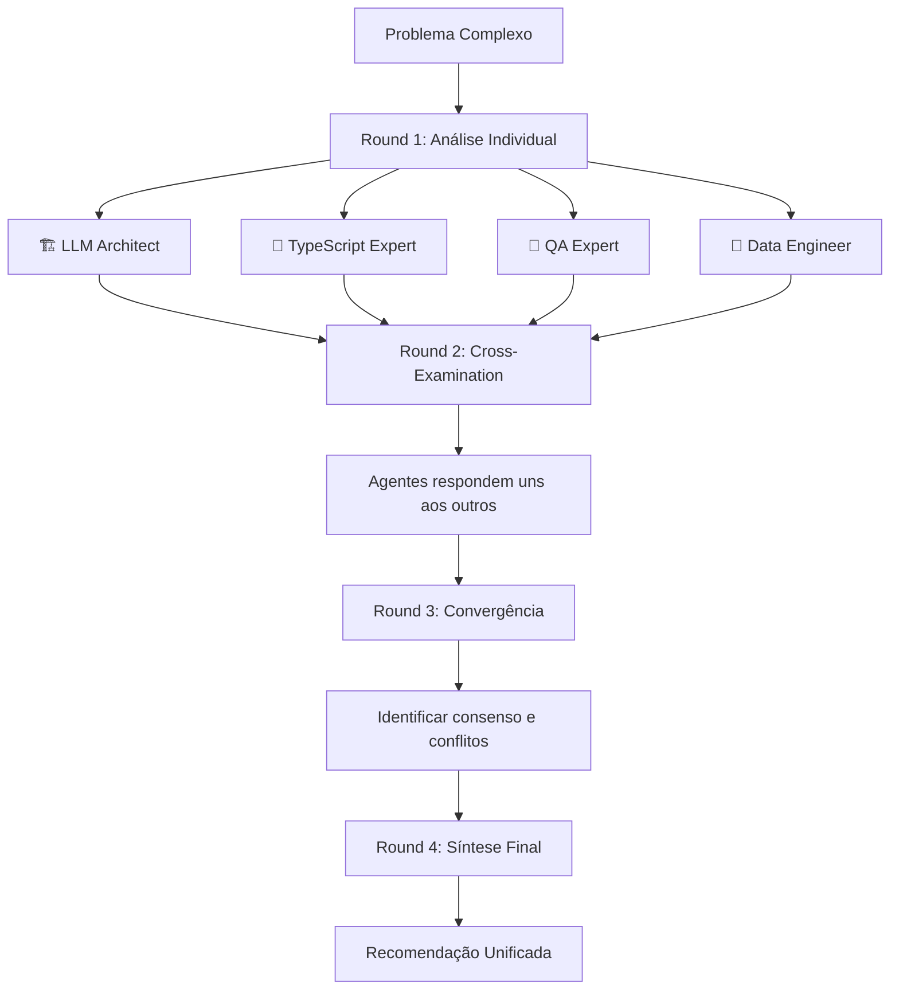

# 🎯 Full Council

Debate multi-agente para problemas complexos que beneficiam de múltiplas perspectivas especializadas.

## Quando Invocar

- Decisões arquitectónicas complexas
- Trade-offs com múltiplas dimensões
- Problemas que cruzam áreas (ex: performance + security + UX)
- Validação de abordagens importantes
- Refactoring de grande escala

## Como Funciona



## Agentes Participantes (Por Default)

| Agente | Perspectiva |
|--------|-------------|
| 🏗️ LLM Architect | Arquitectura de IA, RAG, custos |
| 📘 TypeScript Expert | Type safety, maintainability |
| 🧪 QA Expert | Testabilidade, qualidade |
| 🔧 Data Engineer | Data flow, pipelines |
| ✍️ Prompt Engineer | Prompts, LLM optimization |
| 🔍 Search Specialist | Discovery, retrieval |

## Formato de Debate

### Round 1: Posições Iniciais
Cada agente apresenta a sua análise independente do problema.

### Round 2: Cross-Examination
Agentes respondem aos pontos dos outros, identificando:
- Pontos de concordância
- Pontos de discordância
- Lacunas nas análises

### Round 3: Convergência
Procura de consenso:
- O que todos concordam?
- O que permanece em conflito?
- Que compromissos são viáveis?

### Round 4: Síntese
Output final com:
- **Recomendação principal** (consensual)
- **Pontos de atenção** (riscos identificados)
- **Alternativas** (minority opinions)
- **Next steps** (acções concretas)

## Exemplo de Uso

// turbo-all

```
Pedido: "Devemos migrar o RAG de Gemini File Search para Pinecone?"

Round 1 - Análises:
- 🏗️ LLM Architect: analisa performance, custos, scalability
- 📘 TypeScript Expert: avalia migration effort, type changes
- 🔧 Data Engineer: considera pipeline changes, data migration
- 🧪 QA Expert: planeia testing strategy, rollback plan

Round 2 - Cross-Exam:
- Data Engineer challenge: "LLM Architect, como handled cold starts?"
- QA Expert concern: "Qual é o rollback plan se falhar?"

Round 3 - Convergência:
- Consenso: Pinecone tem melhor scalability
- Conflito: Custo vs benefício para volume actual

Round 4 - Síntese:
- Recomendação: Manter Gemini para MVP, preparar abstração para futura migração
- Próximos passos: Criar interface abstracta, benchmark actual
```

## Integração com lib/council/

Os agentes do council estão implementados em:
- `lib/council/agents/index.ts` — agentes base
- `lib/council/agents/specialized-agents.ts` — agentes especializados
- `lib/council/orchestrator.ts` — lógica de debate

## Configuração

Para customizar o council para um debate específico:

```typescript
import { createAllSpecializedAgents } from '@/lib/council/agents';

const agents = createAllSpecializedAgents(true); // verbose mode
// Executar debate com os agentes
```
